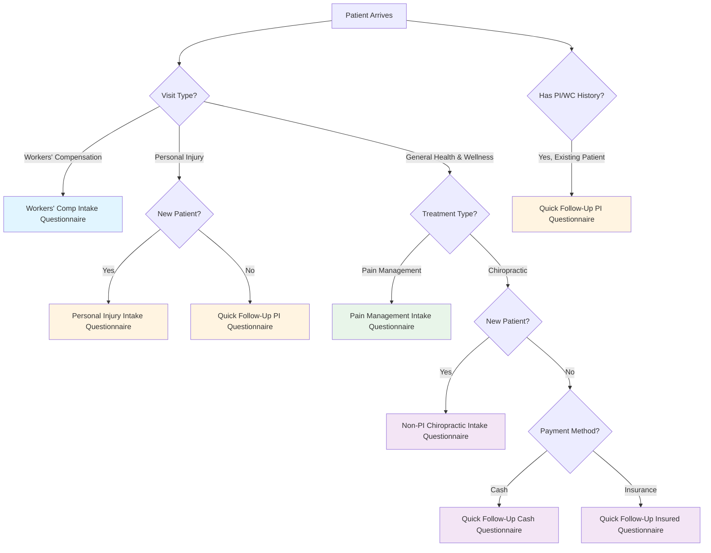

# Intake Routing Decision Tree

This document describes the decision tree logic for routing patients to the appropriate intake questionnaire based on their visit type, treatment modality, payment method, and patient history.

## Decision Tree

## Routing Scenarios

### Scenario 1: Workers' Compensation
- **Condition**: Visit Type = "Workers' Compensation"
- **Route**: `workers-comp-intake-questionnaire.json`
- **Priority**: Highest (checked first)

### Scenario 2: Personal Injury - New Patient
- **Condition**: Visit Type = "Personal Injury" AND New Patient
- **Route**: `personal-injury-intake-questionnaire.json`

### Scenario 3: Personal Injury - Existing Patient
- **Condition**: Visit Type = "Personal Injury" AND Existing Patient
- **Route**: `quick-follow-up-pi-questionnaire.json`

### Scenario 4: Health & Wellness - Pain Management
- **Condition**: Visit Type = "General Health & Wellness" AND Treatment = "Pain Management"
- **Route**: `pain-management-intake-questionnaire.json`

### Scenario 5: Health & Wellness - Chiropractic - New Patient
- **Condition**: Visit Type = "General Health & Wellness" AND Treatment = "Chiropractic" AND New Patient
- **Route**: `non-pi-chiro-intake-questionnaire.json`

### Scenario 6: Health & Wellness - Chiropractic - Existing Patient - Cash
- **Condition**: Visit Type = "General Health & Wellness" AND Treatment = "Chiropractic" AND Existing Patient AND Payment = "Cash"
- **Route**: `quick-follow-up-cash-questionnaire.json`

### Scenario 7: Health & Wellness - Chiropractic - Existing Patient - Insurance
- **Condition**: Visit Type = "General Health & Wellness" AND Treatment = "Chiropractic" AND Existing Patient AND Payment = "Insurance"
- **Route**: `quick-follow-up-insured-questionnaire.json`

### Scenario 8: Existing Patient with PI/WC History (Fallback)
- **Condition**: Existing Patient AND (Has PI History OR Has WC History)
- **Route**: `quick-follow-up-pi-questionnaire.json`

## Patient Status Detection

The routing engine uses the following detection functions to determine patient status:

1. **`isNewPatient(patientId, oystehr)`**: Checks if patient has any previous Encounters
2. **`hasPersonalInjuryHistory(patientId, oystehr)`**: Queries Conditions with category="personal-injury" and checks Patient extension `legal-representation-lop`
3. **`hasWorkersCompHistory(patientId, oystehr)`**: Queries Conditions with category="workers-compensation" and checks Coverage for WC carrier coding
4. **`getPaymentMethod(patientId, oystehr)`**: Determines payment method from Coverage resources and Patient extensions

## Previous Symptoms Fetching

For all follow-up questionnaires (scenarios 3, 6, 7, 8), the system:
- Queries the most recent QuestionnaireResponse (last 90 days)
- Extracts pain regions, severity (0-10), and symptom descriptions
- Displays this information in a read-only "Your Last Visit Summary" section at the top of the questionnaire

## LOP Tracking Triggers

The following scenarios trigger LOP tracking flags:
- Payment Method = "attorney-lop"
- Visit Type = "Personal Injury" (requires CMS-1500)
- Visit Type = "Workers' Compensation" (requires CMS-1500)

## Implementation Details

- **Routing Engine**: `packages/zambdas/src/shared/intake/routing/routingEngine.ts`
- **Patient Status Detection**: `packages/zambdas/src/shared/intake/routing/patientStatusDetection.ts`
- **Zambda Endpoint**: `packages/zambdas/src/patient/intake-routing/index.ts`
